# Pad Thai Recipe Dataset
### **Author**: Matana Pornluanprasert 
### **Date**: 26 November 2024 
### **Link to the Dataset on Kaggle**: [https://www.kaggle.com/datasets/beungz/pad-thai-recipe-dataset](https://www.kaggle.com/datasets/beungz/pad-thai-recipe-dataset)

### **Data Sources**: 
This dataset contains recipe data scraped from the following websites:
- [Yummly](https://www.yummly.com)
- [Allrecipes](https://www.allrecipes.com)

The dataset includes information such as recipe names, ingredients, and creator names, which were originally posted by the users of these platforms. Please refer to the list of creators provided in combined_recipe.csv 

### **License**: 
This dataset is licensed under the [Creative Commons Attribution-NonCommercial 4.0 International License (CC BY-NC 4.0)](https://creativecommons.org/licenses/by-nc/4.0/).

You are free to use, modify, and distribute this dataset for non-commercial purposes, provided that you give appropriate credit to the author. 

### **Important Disclaimer**: 
This dataset is provided for **research and educational purposes only**. Users of this dataset should be mindful of the **terms of service** and **intellectual property rights** of **Yummly.com** and **Allrecipes.com** when using this data. 

### **Data Sourcing Code**: 
[https://github.com/beungz/pad-thai-recipe-data-sourcing](https://github.com/beungz/pad-thai-recipe-data-sourcing) 
***

### Table of Contents
- [Dataset Summary](#dataset-summary)
- [Dataset Structure](#dataset-structure)
- [Potential Biases and Ethics Statement](#potential-biases-and-ethics-statement)
- [Exploratory Data Analysis](#exploratory-data-analysis)
***

# Dataset Summary

### **The Dataset** 
Pad Thai (one of Thailand’s traditional dish) recipe dataset comprising of amount of key ingredients, and review scores on two popular food recipe portal websites, Yummly.com and Allrecipes.com 

This Pad Thai recipes and ingredient data is collected from two data sources: Yummly.com and Allrecipes.com in October 2024, by web scraping. It comprises of 160 recipes from Yummly, and 25 recipes from Allrecipes. 

This recipe data may not represent traditional Pad Thai recipe in Thailand, as its sources are from international community. It provides a general overview of the characters of Pad Thai recipes that are popular outside Thailand. 
***

### **Problem, Motivation and Potential Application** 
Today we can find free food recipes on the internet easily. We can also search on food recipe portals and pick the food recipe with the best reviews, to ensure that we should get good taste, lower ingredient cost, or easier to cook. 

After following many internet recipes, we may want to seek for something even better by trying to adjust combination of ingredients, or amount of ingredients, then post on food recipe portal websites, then wait for other users to try our recipe and give review scores. 

However, in the situation where a new, better recipe is a secret sauce, a restaurant owner or a food producer cannot post a new recipe on public website, as they want to attract more customers and increase their market share by using this new recipe. The alternative to verify if the recipe is better is to test with a group of people and get ratings from them, but this may be costly if there are a lot of recipes to test. 

This problem may be solved by using a linear multiple regression model (or ML model), with amount of key ingredients as inputs/predictors, and expected review score/ratings as an output. 

In order to preliminarily verify if the new recipe should be considered to be better than other recipes, the restaurant owner/food producer may try using the regression/ML model to calculate expected review score first, eliminate those recipes with low expected score, and have real people to try out only recipes with higher predicted ratings. 
***

### **Previous work done to solve this problem** 
Multiple research groups have done food recipe rating prediction models, many of them utilize the models for their own use and not release to the public. However, these models do not normally target at Thai cuisine. 
***

### **Previous datasets in this space** 
At least one similar dataset is available on Kaggle by Shuyang Li and Bodhisattwa Prasad Majumder. It was crawled data from Food.com, and the dataset can be found in the link below: 
[https://www.kaggle.com/datasets/shuyangli94/food-com-recipes-and-user-interactions](https://www.kaggle.com/datasets/shuyangli94/food-com-recipes-and-user-interactions) 
However, it does not provide the exact amount of each ingredient to be used. 
***

### **Type of Data Collected** 
-	name of recipe as given by creator who posted the recipe on the website (string)
-   creator name
-	average review scores/ratings (float)
-   number of reviewers (integer)
-   number of users who saved the recipe, on Yummly.com only (integer)
-   link to the recipe
-   list of ingredients
-	amount of ingredients (float) and associated measurement units (string) 

The dataset does not include steps required to prepare and cook Pad Thai. 
***

### **What is unique about dataset?** 
Although previous dataset is available with 51 Pad Thai recipes, it was updated 5 years ago, the scraped data only comes from Food.com, and it does not provide the exact amount of each ingredient to be used. Our new dataset will focus on Pad Thai recipes, with amount of each ingredient and corresponding review scores from Yummly.com and Allrecipes.com 
***

### **Power Analysis** 
There are 27 ingredient categories used to cook Pad Thai. With the use of G*Power software^, effect size f2 of 0.15 (medium), alpha of 0.05, power of 0.80, and number of predictors at 27, the sample size should be 178. 

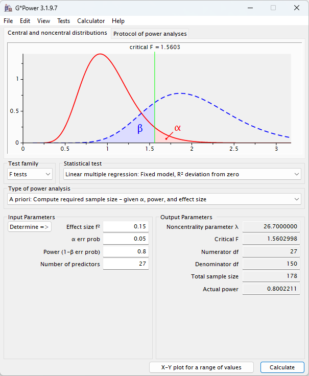 

If some uncommon ingredient categories are removed, the number of predictors can be decreased to 21, and the appropriate sample size will be 160. 

 

^ G*Power: [https://www.psychologie.hhu.de/arbeitsgruppen/allgemeine-psychologie-und-arbeitspsychologie/gpower.html](https://www.psychologie.hhu.de/arbeitsgruppen/allgemeine-psychologie-und-arbeitspsychologie/gpower.html) 
***

### **Data Collection Protocol** 
Data has been collected from two food recipe portal websites, Yummly.com and Allrecipes.com, in their recipe and review section, where creators posted their own recipes publicly and let other users give review scores. The scraped data was organized and cleaned first before consolidating into a single dataset. 

Normalized ratings are provided in order to facilitate comparison of ratings from two different recipe sources, because the mean of ratings from the two websites are different. For example, ratings given by a website with a lot of food experts may be lower compared to a website targeting beginners. 

There are some missing data in original ingredient amount/unit from the sources and are intentionally left missing as it is. The new ingredient unit utilitzed default unit, to fill in missing ingredient units. 

Unit conversion has been applied such that all similar ingredients used the same default_unit, where possible. 

Name of the same ingredient may be different from one recipe to another as it has several alternative names in English (and other languages), so the mapping table of the ingredient name is used to map these alternative names to common name. 

Ingredient category is provided as an alternative to common ingredient names.
There are over 178 ingredients in the dataset (608 for original ingredient names), while the number of ingredient category is just 27. 
***

# Dataset Structure

### **Column Description for the Dataset** 

| Column Name         | Description     |
|--------------|-----------------|
| recipe_id | unique id assigned to all recipe |
| recipe_source | source of the recipe: either yummly or allrecipes |
| recipe_name | recipe name given by the creator |
| recipe_creator_name | name of the recipe creator |
| recipe_ratings | average review scores as given by users on the two websites, in a scale from 1 to 5 |
| recipe_ratings_normalized | normalized score, with the mean and score range, with the final range from 0 to 1 |
| recipe_num_of_reviewers | number of reviewers who rate each recipe |
| recipe_num_saved | number of users on Yummly.com who saved the recipe for reading later |
| recipe_link | link to recipes |
| ingredient_id | unique id assigned to all ingredients (same ingredient but in different recipe > different ingredient_id)  |
| ingredient_name, original_ingredient_amount, original_ingredient_unit | original name, amount, and unit of ingredient on the websites |
| common_ingredient_name, new_ingredient_amount, new_ingredient_unit | common name, new (converted) amount, and new unit of ingredient after mapping/unit conversion and applying manual overrides |
| ingredient_category | category of ingredient  |
| ingredient_remainder | description attached to the ingredient, which include detail of ingredient and preparation instruction, available on Yummly.com  |
| default_unit | default unit which is used in final dataset for each ingredient type |
| columns with ingredient name | amount of ingredient used in each recipe, in reformatted_combined_ingredient.csv, top30.csv, and top10.csv |
 

***

# Potential Biases and Ethics Statement

### **Potential Biases** 
This dataset may contain inherent biases due to the nature of its source and the data it represents. Some of these biases are as follows:

1. **Sample Bias**: 
   The dataset is sourced exclusively from two English-speaking websites—Yummly.com and Allrecipes.com—which introduces a sample bias. These websites primarily feature recipes in English, potentially excluding authentic or traditional Pad Thai recipes that may be shared on Thai-language websites or other regional platforms. Additionally, the dataset represents only recipes submitted by internet users, which may not fully reflect the wide range of traditional recipes that have been passed down orally or exist in non-digital formats. As a result, the dataset may underrepresent the diversity and authenticity of Pad Thai recipes, especially those not widely shared on the selected websites. 

2. **Representation Bias**: 
   The dataset is based solely on user reviews from the two websites, meaning it reflects the opinions of internet users who actively participate on these platforms. This introduces a representation bias, as it excludes the experiences of individuals who do not actively engage with these websites, or those who do not use the internet at all. Consequently, the dataset may not capture a broad spectrum of opinions, particularly those from non-tech-savvy consumers or from people who prefer traditional methods of cooking and might not rely on online recipe platforms. This limited representation could affect the generalizability of any insights derived from the dataset. 

3. **Measurement Bias**: 
    The review scores on these websites are used to measure the quality of the recipes, but this introduces potential measurement bias due to several factors: 
    
    - Influence of Well-Known Creators: Recipes from well-known creators with large followings may receive disproportionately high ratings due to the creators' fan base, rather than the intrinsic quality of the recipe itself. This creates a popularity bias, where high review scores may be more reflective of the creator's reputation rather than the actual taste or authenticity of the dish.
    
    - External Factors Affecting Reviews: High review scores could also result from factors unrelated to the taste or authenticity of the recipe. For example:
    
        - Good Presentation: Recipes that are well-explained, have high-quality photos, or include video tutorials may receive higher ratings simply because they are easier to follow or more visually appealing, rather than being objectively "better-tasting."
    
         - Ease of Cooking or Ingredient Accessibility: Recipes that are easier to prepare or use ingredients that are more readily available may be rated higher, as reviewers may prioritize convenience over the taste or authenticity of the dish. This introduces a convenience bias, where the scores reflect factors like ease of preparation rather than the traditional or authentic nature of the recipe.

4. **Bias in Recipe Presentation**: 
   The way recipes are presented on the source websites (Yummly and Allrecipes) could also affect the dataset. For instance, certain ingredients may be emphasized or downplayed depending on the user's experience or knowledge. Some users may not provide detailed ingredient measurements, leading to missing data or inconsistencies in the dataset. 

### **Addressing Bias** 
While this dataset aims to provide a broad overview of recipes from various sources, users should be aware of the potential biases and use caution when performing analyses or building models based on it. Researchers should strive to diversify their data sources or complement this dataset with other datasets from different geographies, cultures, or dietary preferences in order to mitigate these biases. 
***

### **Ethics Statement** 
This dataset was created with the aim of providing a resource for research and educational purposes. It contains recipes scraped from publicly accessible pages on **Yummly.com** and **Allrecipes.com**. The intention behind sharing this dataset is to enable researchers and practitioners to explore culinary data, develop machine learning models, and conduct analyses that can contribute to various fields, including food science, nutrition, and artificial intelligence.

### **Respecting Intellectual Property** 
The data contained in this dataset is sourced from Yummly and Allrecipes, and as such, users should be mindful of the **terms of service** and **intellectual property rights** of these platforms. The dataset is intended for **non-commercial use only** and users must provide appropriate attribution to the original authors of the recipes and the platforms (Yummly and Allrecipes) when using the data. Users should not violate the intellectual property rights of the original recipe creators by using or reproducing the dataset for commercial purposes without seeking appropriate permissions.

### **Data Privacy** 
This dataset contains publicly available information that is scraped from recipe pages on Yummly and Allrecipes. It does not include any personal or identifiable information about the users who created and shared the recipes with anonymous username. Nonetheless, if certain creator names include other personal identifiable information, care must be taken to anonymize or remove such details to comply with data protection regulations, including GDPR (General Data Protection Regulation), PDPA (Personal Data Protection Act), or similar privacy laws. 

### **Purpose** 
The dataset is meant to facilitate exploration and learning. It is provided under the **Creative Commons Attribution-NonCommercial 4.0** license to ensure that it can be freely shared and used for non-commercial purposes. We encourage the community to use it in a manner that is ethically responsible, keeping in mind the broader impact of data usage, especially in areas like data science, machine learning, and food science. 
***

### **Ethics and Web Scraping Practices** 
This dataset was created using publicly available recipe data from **Yummly.com** and **Allrecipes.com**, with respect to ethical data collection practices and **web scraping restrictions** outlined in the respective **robots.txt** files of these websites. We believe in responsible data sourcing and ensure compliance with the limitations set by the sites' web scraping policies. 

### **Web Scraping Compliance** 
- **Robots.txt Compliance**: We reviewed and followed the guidelines provided in the **robots.txt** files of both Yummly.com and Allrecipes.com, ensuring that our scraping activities adhered to the restrictions set by these websites. 
  
  - For **Yummly.com**, we respected the following rules:
    - **Disallowed Directories**
    - **Crawl-Delay**: We honored the `Crawl-delay` directive, ensuring that the scraping requests were spaced out to reduce server load. 

  - For **Allrecipes.com**, we followed the rules specified in their **robots.txt** file:
    - **Disallowed Directories**
    - **Crawl-Delay**: We adhered to the `Crawl-delay` setting to minimize the impact of scraping on the server. 

- **Respect for Data Ownership**: The data is made available for **non-commercial use** only, in accordance with the terms of service of Yummly and Allrecipes. The dataset does not include personal information about users or creators, and only publicly available recipe data was collected. 

### **Ethical Data Collection** 
- **Minimizing Server Load**: We took steps to ensure that our scraping process did not overload the servers of Yummly and Allrecipes by following the **Crawl-Delay** recommendations. 
- **Publicly Available Data**: Only publicly accessible recipe data was scraped, ensuring no violation of privacy or terms of service. 
- **Dataset Usage**: The dataset is provided for **research and educational purposes only**. Users are required to respect the terms of service of Yummly and Allrecipes when using this dataset, and commercial use or redistribution for profit is prohibited without prior permission. 
***

# Exploratory Data Analysis

### **Data Context and Data Sampling**

    Data Sampling
    ---------------
    
    Recipe Data
         Unnamed: 0 recipe_source recipe_id                 recipe_name  \
    72           72        yummly      Y073  Chicken Pad Thai Meal Prep   
    176         176    allrecipes      A017          Pad Thai with Tofu   
    12           12        yummly      Y013                    Pad Thai   
    96           96        yummly      Y097            Cheater Pad Thai   
    58           58        yummly      Y059            One-Pot Pad Thai   
    
        recipe_creator_name  recipe_ratings  recipe_num_of_reviewers  \
    72             TIP BUZZ             2.5                        2   
    176            Van Dana             4.2                        5   
    12           BOOKCOOKER             5.0                        1   
    96       STEAMY KITCHEN             5.0                        2   
    58             BUZZFEED             4.0                        3   
    
         recipe_num_saved                                        recipe_link  \
    72              716.0  https://www.yummly.com/recipe/Chicken-Pad-Thai...   
    176               NaN  https://www.allrecipes.com/recipe/246141/pad-t...   
    12              420.0     https://www.yummly.com/recipe/Pad-Thai-1753549   
    96              857.0  https://www.yummly.com/recipe/Cheater-Pad-Thai...   
    58             1000.0  https://www.yummly.com/recipe/One-Pot-Pad-Thai...   
    
         recipe_ratings_normalized  
    72                    0.274874  
    176                   0.498381  
    12                    0.587374  
    96                    0.587374  
    58                    0.462374  
    
    Ingredient Data
          Unnamed: 0 ingredient_id recipe_id             ingredient_name  \
    1077        1077       Y069_04      Y069                  red pepper   
    1705        1705       Y110_14      Y110           red pepper flakes   
    2548        2548       A003_11      A003                 white sugar   
    2911        2911       A025_02      A025             dark sesame oil   
    2641        2641       A009_08      A009  vegetable or chicken broth   
    
          original_ingredient_amount original_ingredient_unit  \
    1077                        0.50                      NaN   
    1705                        2.00                     tsp.   
    2548                        0.75               tablespoon   
    2911                        1.00               tablespoon   
    2641                        0.50                      cup   
    
         ingredient_remainder recipe_source  new_ingredient_amount  \
    1077              (diced)        yummly                   0.50   
    1705                  NaN        yummly                   2.00   
    2548                  NaN    allrecipes                   0.75   
    2911                  NaN    allrecipes                   1.00   
    2641                  NaN    allrecipes                   0.50   
    
         new_ingredient_unit common_ingredient_name         ingredient_category  \
    1077                unit                 pepper              chili / pepper   
    1705            teaspoon           chili flakes              chili / pepper   
    2548          tablespoon            white sugar  sugar / sweeteners / syrup   
    2911          tablespoon             sesame oil                         oil   
    2641                 cup          chicken broth               broth / stock   
    
         default_unit  
    1077         unit  
    1705     teaspoon  
    2548   tablespoon  
    2911   tablespoon  
    2641          cup  
    

***
This Pad Thai recipes and ingredient data is collected from two data sources: Yummly.com and Allrecipes.com in October 2024, by web scraping. It comprises of 160 recipes from Yummly, and 25 recipes from Allrecipes, all of which includes recipe name, creator name, review score (ratings), link to website, and corresponding ingredient name/amount/unit. The recipes do not include steps required to prepare and cook Pad Thai 

There are some missing data in ingredient amount/unit from the sources (original_ingredient_amount and original_ingredient_unit) and are intentionally left missing as it is. The new_ingredient_unit utilitzed default_unit, to fill in missing ingredient units. Unit conversion has been applied such that all similar ingredients used the same default_unit, where possible. 

Normalized ratings are provided in order to facilitate comparison of ratings from two different recipe sources. 

This recipe data may not represent traditional Pad Thai recipe in Thailand, as its sources are from international community. It provides a general overview of the characters of Pad Thai recipes that are popular outside Thailand.
***

### **Data Structure**

    
    Data Structure
    ---------------
    
    Recipe Data
    Dimensions: (185, 10)
    Data Types:
    Unnamed: 0                     int64
    recipe_source                 object
    recipe_id                     object
    recipe_name                   object
    recipe_creator_name           object
    recipe_ratings               float64
    recipe_num_of_reviewers        int64
    recipe_num_saved             float64
    recipe_link                   object
    recipe_ratings_normalized    float64
    dtype: object
    Missing Values:
    Unnamed: 0                    0
    recipe_source                 0
    recipe_id                     0
    recipe_name                   0
    recipe_creator_name           0
    recipe_ratings                0
    recipe_num_of_reviewers       0
    recipe_num_saved             25
    recipe_link                   0
    recipe_ratings_normalized     0
    dtype: int64
    
    Ingredient Data
    Dimensions: (2922, 13)
    Data Types:
    Unnamed: 0                      int64
    ingredient_id                  object
    recipe_id                      object
    ingredient_name                object
    original_ingredient_amount    float64
    original_ingredient_unit       object
    ingredient_remainder           object
    recipe_source                  object
    new_ingredient_amount         float64
    new_ingredient_unit            object
    common_ingredient_name         object
    ingredient_category            object
    default_unit                   object
    dtype: object
    Missing Values:
    Unnamed: 0                       0
    ingredient_id                    0
    recipe_id                        0
    ingredient_name                  0
    original_ingredient_amount     260
    original_ingredient_unit       822
    ingredient_remainder          1531
    recipe_source                    0
    new_ingredient_amount          256
    new_ingredient_unit              0
    common_ingredient_name           0
    ingredient_category              0
    default_unit                     0
    dtype: int64
    

***
### **Interpretation of Data Structure**

There are 185 Pad Thai recipes (recipe_name), each with unique recipe id (recipe_id) assigned. Relevant detail of each recipe, including recipe name (recipe_name), recipe source (recipe_source), creator name (recipe_creator_name), review scores (recipe_ratings), normalized scores (recipe_ratings_normalized), number of reviewers (recipe_num_of_reviewers), link to website (recipe_link), list of ingredients (ingredient_id, ingredient_name, common_ingredient_name, ingredient_category), and their corresponding amount/unit (original_ingredient_amount, original_ingredient_unit, new_ingredient_amount, new_ingredient_unit) are provided. 

The number of saved recipes (recipe_num_saved) are from Yummly.com only, as it does not exist on Allrecipes.com. The ingredient_remainder comes from a description/detail of how to prepare ingredients before cooking, and is available on Yummly.com. On Allrecipes.com, the detail/preparation note of ingredients are included in the name of the ingredients themselves. 

There are some missing data in ingredient amount/unit from the sources (original_ingredient_amount and original_ingredient_unit), as the creators did not specify them on the websites. We left them  missing as it is, and provide new_ingredient_unit as a substitute. The new_ingredient_unit utilitzed default_unit, to fill in missing ingredient units. The ingredient amount, both original and new, are numeric (float) 

The review scores are given by users on the two websites, on an integer scale from 1 to 5, with recipe_ratings as a simple average (float). We also calculate normalized ratings (float) and include it here as recipe_ratings_normalized. All recipes in this dataset have review scores, with at least one reviewer. 
***

### **Descriptive Statistics**

    
    Descriptive Statistics
    ----------------------
    
    Recipe Data
    ----------------------
    Central Tendency Measures:
          Unnamed: 0  recipe_ratings  recipe_num_of_reviewers  recipe_num_saved  \
    mean        92.0        4.235674                17.243243        1227.13125   
    50%         92.0        4.500000                 2.000000         170.50000   
    
          recipe_ratings_normalized  
    mean                   0.493320  
    50%                    0.524874  
    
    Dispersion Measures:
         Unnamed: 0  recipe_ratings  recipe_num_of_reviewers  recipe_num_saved  \
    std   53.549043        0.942097                72.269501       5880.782784   
    min    0.000000        1.000000                 1.000000          4.000000   
    max  184.000000        5.000000               764.000000      68000.000000   
    
         recipe_ratings_normalized  
    std                   0.118206  
    min                   0.087374  
    max                   0.598381  
    
    Distribution Measures:
    Skewness:
    Unnamed: 0                   0.000000
    recipe_ratings              -1.790303
    recipe_num_of_reviewers      7.596137
    recipe_num_saved             9.875733
    recipe_ratings_normalized   -1.799404
    dtype: float64
    Kurtosis:
    Unnamed: 0                    -1.200000
    recipe_ratings                 3.270065
    recipe_num_of_reviewers       68.234337
    recipe_num_saved             107.714558
    recipe_ratings_normalized      3.274691
    dtype: float64
    
    Ingredient Data: Top 30
    ----------------------
    Central Tendency Measures:
          Unnamed: 0  recipe_ratings  recipe_ratings_normalized   peanut  \
    mean        92.0        4.235674                   0.493320  5.86828   
    50%         92.0        4.500000                   0.524874  4.00000   
    
            garlic  scallion / spring onion / green onion  rice noodle  \
    mean  2.692262                               0.777455     7.975741   
    50%   2.000000                               0.750000     8.000000   
    
          bean sprout  soy sauce  coriander / cilantro  ...  sriracha sauce  \
    mean     1.382542   2.648173              5.385264  ...        1.056818   
    50%      1.000000   2.750000              4.500000  ...        1.000000   
    
          chili flakes  vegetable oil      lime  firm tofu     sugar      salt  \
    mean      0.661638       2.645833  1.147059   8.438541  2.520833  0.272569   
    50%       0.500000       2.000000  1.000000   8.000000  2.000000  0.125000   
    
          minced ginger  bell pepper  sesame oil  
    mean        2.50303     0.903226    1.316092  
    50%         3.00000     1.000000    1.000000  
    
    [2 rows x 33 columns]
    
    Dispersion Measures:
         Unnamed: 0  recipe_ratings  recipe_ratings_normalized     peanut  \
    std   53.549043        0.942097                   0.118206   4.166416   
    min    0.000000        1.000000                   0.087374   0.000000   
    max  184.000000        5.000000                   0.598381  24.000000   
    
           garlic  scallion / spring onion / green onion  rice noodle  \
    std  1.423506                               0.530956     3.096320   
    min  0.500000                               0.041667     0.000000   
    max  9.000000                               4.500000    16.014378   
    
         bean sprout  soy sauce  coriander / cilantro  ...  sriracha sauce  \
    std     0.846057   1.513455              3.449585  ...        0.944523   
    min     0.062500   0.166667              0.083333  ...        0.041667   
    max     5.000000   8.000000             16.000000  ...        4.000000   
    
         chili flakes  vegetable oil      lime  firm tofu     sugar      salt  \
    std      0.482251       1.455018  0.657468   4.324439  1.756580  0.314175   
    min      0.062500       0.666667  0.500000   1.000000  0.333333  0.010417   
    max      2.000000       8.000000  3.000000  16.000000  9.000000  1.000000   
    
         minced ginger  bell pepper  sesame oil  
    std       1.469318     0.200805    1.177117  
    min       0.250000     0.500000    0.166667  
    max       6.000000     1.000000    4.000000  
    
    [3 rows x 33 columns]
    
    Distribution Measures:
    Skewness:
    Unnamed: 0                                                0.000000
    recipe_ratings                                           -1.790303
    recipe_ratings_normalized                                -1.799404
    peanut                                                    2.021440
    garlic                                                    1.524615
    scallion / spring onion / green onion                     2.908130
    rice noodle                                               0.623504
    bean sprout                                               1.394499
    soy sauce                                                 0.669576
    coriander / cilantro                                      1.175170
    egg                                                       1.009785
    fish sauce                                                0.708245
    carrot                                                    0.997393
    lime juice                                                1.467960
    lime wedge                                                2.117400
    peanut butter                                             2.857806
    vinegar                                                   4.791147
    water                                                     2.723946
    brown sugar                                               0.406565
    chicken breast                                            0.718191
    pepper                                                    5.857025
    tamarind concentrate / tamarind paste / tamarind juice    1.900245
    shrimp                                                    0.456140
    sriracha sauce                                            1.900603
    chili flakes                                              1.686528
    vegetable oil                                             1.575702
    lime                                                      1.540588
    firm tofu                                                 0.315664
    sugar                                                     2.003874
    salt                                                      1.500642
    minced ginger                                             0.886648
    bell pepper                                              -1.631366
    sesame oil                                                1.173167
    dtype: float64
    Kurtosis:
    Unnamed: 0                                                -1.200000
    recipe_ratings                                             3.270065
    recipe_ratings_normalized                                  3.274691
    peanut                                                     5.508852
    garlic                                                     4.360386
    scallion / spring onion / green onion                     17.689554
    rice noodle                                                0.742942
    bean sprout                                                2.825444
    soy sauce                                                  0.564867
    coriander / cilantro                                       2.340110
    egg                                                        1.404630
    fish sauce                                                 0.393538
    carrot                                                     0.472993
    lime juice                                                 3.671585
    lime wedge                                                 4.769812
    peanut butter                                             10.638284
    vinegar                                                   28.845674
    water                                                      8.149507
    brown sugar                                               -0.465711
    chicken breast                                             1.124212
    pepper                                                    34.507234
    tamarind concentrate / tamarind paste / tamarind juice     5.109517
    shrimp                                                    -0.463667
    sriracha sauce                                             4.220518
    chili flakes                                               2.594896
    vegetable oil                                              3.607668
    lime                                                       2.082745
    firm tofu                                                 -1.004545
    sugar                                                      5.514833
    salt                                                       1.476361
    minced ginger                                              1.035572
    bell pepper                                                0.702463
    sesame oil                                                 0.596169
    dtype: float64
    

***
### **Interpretation of Descriptive Statistics**

The mean and median are given here to represent the central location of the data, which are ingredient amount and review score, while standard deviation, min and max help us understand more about the range and spread of data. Skewness indicate if it is right skew (positive), left skew (negative), or symmetric (0). Kurtosis helps us understand the tailedness of the data distribution (close to zero: normal distribution; higher values: heavier tails) 

For example, average amount of rice noodle is 7.975741 ounce and median is approximately the same, so the amount of rice noodle may have symmetric distribution. It ranges from 0.000000 to 16.014378 ounce, with standard deviation of 3.096320. It is right skew (0.623504) and based on the kurtosis (0.742942), we may assume that it is likely to be normal distribution. 

Features with skewness and kurtosis between -2 to +2, which may indicate that they may be Gaussian-like 
- rice noodle
- soy sauce
- egg
- fish sauce
- carrot
- brown sugar
- chicken breast
- shrimp
- firm tofu
- salt
- minced ginger
- bell pepper
- sesame oil
***

### **Data Quality**

    
    Data Quality
    ------------
    
    Recipe Data
    ------------
    Duplicated Rows: 0
    Checking for Inconsistent Values:
                                                             most_frequent_value
    Unnamed: 0                                                                 0
    recipe_source                                                         yummly
    recipe_id                                                               Y001
    recipe_name                                                         Pad Thai
    recipe_creator_name                                          A SAUCY KITCHEN
    recipe_ratings                                                           5.0
    recipe_num_of_reviewers                                                    1
    recipe_num_saved                                                      1000.0
    recipe_link                https://www.yummly.com/recipe/Chicken-Pad-Thai...
    recipe_ratings_normalized                                           0.587374
    
    Ingredient Data
    ------------
    Duplicated Rows: 0
    Checking for Inconsistent Values:
                               most_frequent_value
    Unnamed: 0                                2921
    ingredient_id                          A025_12
    recipe_id                                 A014
    ingredient_name                   bean sprouts
    original_ingredient_amount                 1.0
    original_ingredient_unit                 Tbsp.
    ingredient_remainder                 (chopped)
    recipe_source                           yummly
    new_ingredient_amount                      1.0
    new_ingredient_unit                 tablespoon
    common_ingredient_name                  peanut
    ingredient_category                  vegetable
    default_unit                        tablespoon
    

***
### **Interpretation of Data Quality**

Duplicated Rows: There is no duplicated rows in the dataset. 

Inconsistent Values: Most frequent values are shown here for each column to help identify inconsistencies or anomalies. Based on most frequent values, there is no potential inconsistencies or anomalies. 
***

### **Variable Relationships**

    
    Variable Relationships
    ----------------------
    
    Recipe Data
    ----------------------
    Correlation Matrix:
                               Unnamed: 0  recipe_ratings  \
    Unnamed: 0                   1.000000        0.146783   
    recipe_ratings               0.146783        1.000000   
    recipe_num_of_reviewers      0.222098       -0.001055   
    recipe_num_saved            -0.150199        0.012204   
    recipe_ratings_normalized    0.165134        0.999496   
    
                               recipe_num_of_reviewers  recipe_num_saved  \
    Unnamed: 0                                0.222098         -0.150199   
    recipe_ratings                           -0.001055          0.012204   
    recipe_num_of_reviewers                   1.000000          0.910420   
    recipe_num_saved                          0.910420          1.000000   
    recipe_ratings_normalized                 0.013556          0.012204   
    
                               recipe_ratings_normalized  
    Unnamed: 0                                  0.165134  
    recipe_ratings                              0.999496  
    recipe_num_of_reviewers                     0.013556  
    recipe_num_saved                            0.012204  
    recipe_ratings_normalized                   1.000000  
    

    
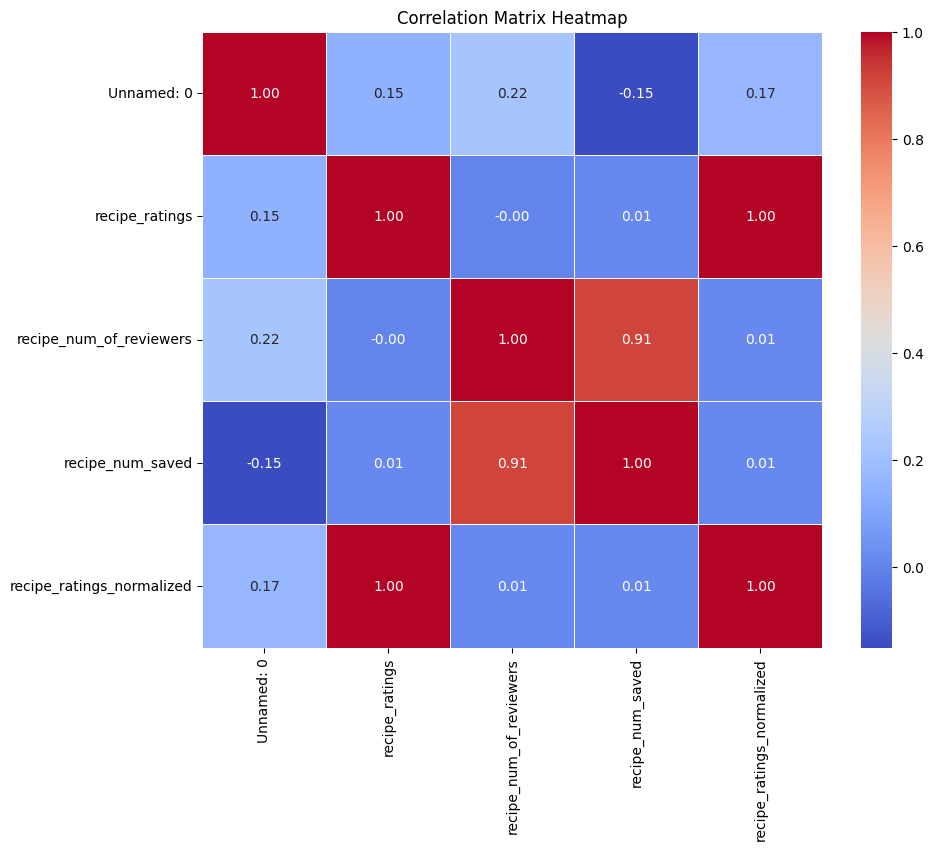
    

    
    Ingredient Data: Top 30
    ----------------------
    Correlation Matrix:
                                                        Unnamed: 0  \
    Unnamed: 0                                            1.000000   
    recipe_ratings                                        0.146783   
    recipe_ratings_normalized                             0.165134   
    peanut                                                0.148422   
    garlic                                               -0.009619   
    scallion / spring onion / green onion                -0.020292   
    rice noodle                                           0.108890   
    bean sprout                                           0.202909   
    soy sauce                                            -0.096568   
    coriander / cilantro                                 -0.209455   
    egg                                                   0.203079   
    fish sauce                                            0.082453   
    carrot                                               -0.051369   
    lime juice                                           -0.249770   
    lime wedge                                           -0.283506   
    peanut butter                                         0.161841   
    vinegar                                               0.213957   
    water                                                -0.171232   
    brown sugar                                          -0.081567   
    chicken breast                                       -0.055384   
    pepper                                                0.136491   
    tamarind concentrate / tamarind paste / tamarin...   -0.311468   
    shrimp                                               -0.157882   
    sriracha sauce                                        0.264497   
    chili flakes                                          0.185587   
    vegetable oil                                         0.020975   
    lime                                                 -0.254919   
    firm tofu                                             0.099542   
    sugar                                                -0.245815   
    salt                                                  0.176995   
    minced ginger                                         0.139844   
    bell pepper                                           0.087295   
    sesame oil                                           -0.026163   
    
                                                        recipe_ratings  \
    Unnamed: 0                                                0.146783   
    recipe_ratings                                            1.000000   
    recipe_ratings_normalized                                 0.999496   
    peanut                                                    0.053850   
    garlic                                                   -0.056562   
    scallion / spring onion / green onion                    -0.050080   
    rice noodle                                               0.008517   
    bean sprout                                               0.131706   
    soy sauce                                                 0.093643   
    coriander / cilantro                                      0.107301   
    egg                                                       0.122553   
    fish sauce                                                0.073767   
    carrot                                                    0.038807   
    lime juice                                               -0.029117   
    lime wedge                                               -0.066812   
    peanut butter                                            -0.214074   
    vinegar                                                  -0.068445   
    water                                                     0.035896   
    brown sugar                                              -0.028995   
    chicken breast                                            0.035440   
    pepper                                                    0.077216   
    tamarind concentrate / tamarind paste / tamarin...       -0.031712   
    shrimp                                                    0.190257   
    sriracha sauce                                            0.143614   
    chili flakes                                              0.097922   
    vegetable oil                                             0.040557   
    lime                                                     -0.036482   
    firm tofu                                                 0.151297   
    sugar                                                     0.194721   
    salt                                                      0.288958   
    minced ginger                                             0.037411   
    bell pepper                                               0.180425   
    sesame oil                                               -0.010218   
    
                                                        recipe_ratings_normalized  \
    Unnamed: 0                                                           0.165134   
    recipe_ratings                                                       0.999496   
    recipe_ratings_normalized                                            1.000000   
    peanut                                                               0.062220   
    garlic                                                              -0.057964   
    scallion / spring onion / green onion                               -0.050077   
    rice noodle                                                          0.012905   
    bean sprout                                                          0.145202   
    soy sauce                                                            0.091182   
    coriander / cilantro                                                 0.101599   
    egg                                                                  0.133173   
    fish sauce                                                           0.081311   
    carrot                                                               0.035482   
    lime juice                                                          -0.031318   
    lime wedge                                                          -0.086140   
    peanut butter                                                       -0.214831   
    vinegar                                                             -0.062339   
    water                                                                0.029240   
    brown sugar                                                         -0.033268   
    chicken breast                                                       0.034871   
    pepper                                                               0.075454   
    tamarind concentrate / tamarind paste / tamarin...                  -0.038719   
    shrimp                                                               0.187935   
    sriracha sauce                                                       0.150072   
    chili flakes                                                         0.101701   
    vegetable oil                                                        0.050997   
    lime                                                                -0.033500   
    firm tofu                                                            0.146520   
    sugar                                                                0.193622   
    salt                                                                 0.315033   
    minced ginger                                                        0.041093   
    bell pepper                                                          0.185168   
    sesame oil                                                          -0.023519   
    
                                                          peanut    garlic  \
    Unnamed: 0                                          0.148422 -0.009619   
    recipe_ratings                                      0.053850 -0.056562   
    recipe_ratings_normalized                           0.062220 -0.057964   
    peanut                                              1.000000 -0.109429   
    garlic                                             -0.109429  1.000000   
    scallion / spring onion / green onion              -0.006226  0.130785   
    rice noodle                                         0.154472  0.038757   
    bean sprout                                         0.272470  0.119265   
    soy sauce                                          -0.091270 -0.016078   
    coriander / cilantro                                0.044915  0.021961   
    egg                                                 0.163504  0.037292   
    fish sauce                                         -0.009002 -0.109490   
    carrot                                             -0.015805 -0.274608   
    lime juice                                         -0.077252 -0.100875   
    lime wedge                                         -0.242202 -0.042140   
    peanut butter                                      -0.117613  0.177186   
    vinegar                                             0.293787 -0.067390   
    water                                               0.115315 -0.058549   
    brown sugar                                        -0.079063  0.229781   
    chicken breast                                      0.052873  0.052372   
    pepper                                             -0.127020  0.128609   
    tamarind concentrate / tamarind paste / tamarin... -0.036145  0.178863   
    shrimp                                             -0.018327  0.076286   
    sriracha sauce                                      0.842316 -0.274048   
    chili flakes                                        0.074887  0.258140   
    vegetable oil                                       0.205478  0.024352   
    lime                                               -0.010860  0.026951   
    firm tofu                                          -0.020097  0.117218   
    sugar                                              -0.211104 -0.289601   
    salt                                                0.027808 -0.066212   
    minced ginger                                       0.116011 -0.441713   
    bell pepper                                        -0.256907  0.164798   
    sesame oil                                         -0.226867  0.031065   
    
                                                        scallion / spring onion / green onion  \
    Unnamed: 0                                                                      -0.020292   
    recipe_ratings                                                                  -0.050080   
    recipe_ratings_normalized                                                       -0.050077   
    peanut                                                                          -0.006226   
    garlic                                                                           0.130785   
    scallion / spring onion / green onion                                            1.000000   
    rice noodle                                                                      0.110182   
    bean sprout                                                                      0.066283   
    soy sauce                                                                        0.058398   
    coriander / cilantro                                                             0.115045   
    egg                                                                              0.100717   
    fish sauce                                                                       0.070538   
    carrot                                                                           0.070799   
    lime juice                                                                      -0.167855   
    lime wedge                                                                       0.130736   
    peanut butter                                                                   -0.058033   
    vinegar                                                                         -0.166411   
    water                                                                           -0.027979   
    brown sugar                                                                      0.013253   
    chicken breast                                                                  -0.099515   
    pepper                                                                          -0.141187   
    tamarind concentrate / tamarind paste / tamarin...                              -0.256955   
    shrimp                                                                          -0.166317   
    sriracha sauce                                                                   0.366923   
    chili flakes                                                                     0.373694   
    vegetable oil                                                                   -0.078553   
    lime                                                                            -0.170507   
    firm tofu                                                                        0.210407   
    sugar                                                                            0.404236   
    salt                                                                             0.328943   
    minced ginger                                                                    0.074520   
    bell pepper                                                                     -0.230652   
    sesame oil                                                                      -0.270237   
    
                                                        rice noodle  bean sprout  \
    Unnamed: 0                                             0.108890     0.202909   
    recipe_ratings                                         0.008517     0.131706   
    recipe_ratings_normalized                              0.012905     0.145202   
    peanut                                                 0.154472     0.272470   
    garlic                                                 0.038757     0.119265   
    scallion / spring onion / green onion                  0.110182     0.066283   
    rice noodle                                            1.000000     0.084366   
    bean sprout                                            0.084366     1.000000   
    soy sauce                                              0.017777    -0.053027   
    coriander / cilantro                                   0.003745    -0.114968   
    egg                                                    0.548599     0.137963   
    fish sauce                                             0.176357     0.258425   
    carrot                                                 0.057087    -0.016810   
    lime juice                                             0.106432     0.113358   
    lime wedge                                             0.208652    -0.346017   
    peanut butter                                          0.258026    -0.194779   
    vinegar                                               -0.185493    -0.113582   
    water                                                  0.048094    -0.226763   
    brown sugar                                            0.134778    -0.107298   
    chicken breast                                         0.405644    -0.248785   
    pepper                                                 0.064333    -0.524907   
    tamarind concentrate / tamarind paste / tamarin...    -0.414928    -0.006487   
    shrimp                                                 0.057755    -0.146884   
    sriracha sauce                                         0.125413     0.552517   
    chili flakes                                           0.178533    -0.097281   
    vegetable oil                                          0.242514     0.252212   
    lime                                                   0.430832     0.391607   
    firm tofu                                              0.436417    -0.137810   
    sugar                                                 -0.039955    -0.082468   
    salt                                                   0.207005    -0.083415   
    minced ginger                                         -0.659276    -0.298958   
    bell pepper                                           -0.028617    -0.124262   
    sesame oil                                             0.273793    -0.339088   
    
                                                        soy sauce  \
    Unnamed: 0                                          -0.096568   
    recipe_ratings                                       0.093643   
    recipe_ratings_normalized                            0.091182   
    peanut                                              -0.091270   
    garlic                                              -0.016078   
    scallion / spring onion / green onion                0.058398   
    rice noodle                                          0.017777   
    bean sprout                                         -0.053027   
    soy sauce                                            1.000000   
    coriander / cilantro                                 0.081256   
    egg                                                  0.175949   
    fish sauce                                          -0.044664   
    carrot                                               0.058506   
    lime juice                                          -0.193827   
    lime wedge                                           0.292410   
    peanut butter                                        0.180033   
    vinegar                                             -0.047338   
    water                                                0.134913   
    brown sugar                                          0.152460   
    chicken breast                                      -0.033281   
    pepper                                              -0.095403   
    tamarind concentrate / tamarind paste / tamarin...  -0.119697   
    shrimp                                              -0.165674   
    sriracha sauce                                      -0.126329   
    chili flakes                                        -0.160555   
    vegetable oil                                       -0.344235   
    lime                                                 0.259199   
    firm tofu                                           -0.431343   
    sugar                                                0.313029   
    salt                                                -0.035150   
    minced ginger                                       -0.222165   
    bell pepper                                          0.015074   
    sesame oil                                          -0.008909   
    
                                                        coriander / cilantro  ...  \
    Unnamed: 0                                                     -0.209455  ...   
    recipe_ratings                                                  0.107301  ...   
    recipe_ratings_normalized                                       0.101599  ...   
    peanut                                                          0.044915  ...   
    garlic                                                          0.021961  ...   
    scallion / spring onion / green onion                           0.115045  ...   
    rice noodle                                                     0.003745  ...   
    bean sprout                                                    -0.114968  ...   
    soy sauce                                                       0.081256  ...   
    coriander / cilantro                                            1.000000  ...   
    egg                                                             0.067494  ...   
    fish sauce                                                     -0.282489  ...   
    carrot                                                         -0.024940  ...   
    lime juice                                                     -0.129056  ...   
    lime wedge                                                      0.273059  ...   
    peanut butter                                                  -0.201451  ...   
    vinegar                                                        -0.208891  ...   
    water                                                           0.346641  ...   
    brown sugar                                                    -0.070186  ...   
    chicken breast                                                  0.048375  ...   
    pepper                                                          0.482035  ...   
    tamarind concentrate / tamarind paste / tamarin...             -0.008666  ...   
    shrimp                                                          0.118012  ...   
    sriracha sauce                                                 -0.129508  ...   
    chili flakes                                                   -0.033774  ...   
    vegetable oil                                                  -0.193166  ...   
    lime                                                           -0.250394  ...   
    firm tofu                                                       0.266899  ...   
    sugar                                                           0.243020  ...   
    salt                                                            0.430900  ...   
    minced ginger                                                  -0.061109  ...   
    bell pepper                                                    -0.156086  ...   
    sesame oil                                                      0.105202  ...   
    
                                                        sriracha sauce  \
    Unnamed: 0                                                0.264497   
    recipe_ratings                                            0.143614   
    recipe_ratings_normalized                                 0.150072   
    peanut                                                    0.842316   
    garlic                                                   -0.274048   
    scallion / spring onion / green onion                     0.366923   
    rice noodle                                               0.125413   
    bean sprout                                               0.552517   
    soy sauce                                                -0.126329   
    coriander / cilantro                                     -0.129508   
    egg                                                      -0.205607   
    fish sauce                                                0.006864   
    carrot                                                    0.185323   
    lime juice                                               -0.062923   
    lime wedge                                               -0.875261   
    peanut butter                                            -0.185663   
    vinegar                                                  -0.376417   
    water                                                    -0.481735   
    brown sugar                                               0.023723   
    chicken breast                                            0.696311   
    pepper                                                   -0.591554   
    tamarind concentrate / tamarind paste / tamarin...       -0.154475   
    shrimp                                                    0.210183   
    sriracha sauce                                            1.000000   
    chili flakes                                              0.000000   
    vegetable oil                                             0.046035   
    lime                                                     -0.813222   
    firm tofu                                                 0.571319   
    sugar                                                     0.755929   
    salt                                                           NaN   
    minced ginger                                            -0.009839   
    bell pepper                                               0.025233   
    sesame oil                                               -0.016001   
    
                                                        chili flakes  \
    Unnamed: 0                                              0.185587   
    recipe_ratings                                          0.097922   
    recipe_ratings_normalized                               0.101701   
    peanut                                                  0.074887   
    garlic                                                  0.258140   
    scallion / spring onion / green onion                   0.373694   
    rice noodle                                             0.178533   
    bean sprout                                            -0.097281   
    soy sauce                                              -0.160555   
    coriander / cilantro                                   -0.033774   
    egg                                                     0.228497   
    fish sauce                                             -0.277008   
    carrot                                                 -0.428087   
    lime juice                                              0.032721   
    lime wedge                                             -0.284089   
    peanut butter                                          -0.093646   
    vinegar                                                 0.439505   
    water                                                  -0.202638   
    brown sugar                                             0.277945   
    chicken breast                                          0.095059   
    pepper                                                 -0.583333   
    tamarind concentrate / tamarind paste / tamarin...     -0.779748   
    shrimp                                                 -0.316532   
    sriracha sauce                                          0.000000   
    chili flakes                                            1.000000   
    vegetable oil                                          -0.047122   
    lime                                                   -0.395984   
    firm tofu                                               0.932790   
    sugar                                                  -0.368134   
    salt                                                    0.409644   
    minced ginger                                          -0.653233   
    bell pepper                                                  NaN   
    sesame oil                                             -0.925926   
    
                                                        vegetable oil  \
    Unnamed: 0                                               0.020975   
    recipe_ratings                                           0.040557   
    recipe_ratings_normalized                                0.050997   
    peanut                                                   0.205478   
    garlic                                                   0.024352   
    scallion / spring onion / green onion                   -0.078553   
    rice noodle                                              0.242514   
    bean sprout                                              0.252212   
    soy sauce                                               -0.344235   
    coriander / cilantro                                    -0.193166   
    egg                                                      0.371562   
    fish sauce                                               0.019367   
    carrot                                                  -0.073830   
    lime juice                                               0.087118   
    lime wedge                                              -0.148522   
    peanut butter                                           -0.203314   
    vinegar                                                  0.218750   
    water                                                   -0.242465   
    brown sugar                                              0.844722   
    chicken breast                                          -0.116857   
    pepper                                                        NaN   
    tamarind concentrate / tamarind paste / tamarin...       0.026060   
    shrimp                                                   0.160128   
    sriracha sauce                                           0.046035   
    chili flakes                                            -0.047122   
    vegetable oil                                            1.000000   
    lime                                                     0.258186   
    firm tofu                                               -0.240256   
    sugar                                                   -0.636364   
    salt                                                    -0.135382   
    minced ginger                                           -0.466652   
    bell pepper                                              0.463348   
    sesame oil                                               1.000000   
    
                                                                lime  firm tofu  \
    Unnamed: 0                                         -2.549187e-01   0.099542   
    recipe_ratings                                     -3.648203e-02   0.151297   
    recipe_ratings_normalized                          -3.350017e-02   0.146520   
    peanut                                             -1.085970e-02  -0.020097   
    garlic                                              2.695103e-02   0.117218   
    scallion / spring onion / green onion              -1.705074e-01   0.210407   
    rice noodle                                         4.308318e-01   0.436417   
    bean sprout                                         3.916069e-01  -0.137810   
    soy sauce                                           2.591986e-01  -0.431343   
    coriander / cilantro                               -2.503942e-01   0.266899   
    egg                                                -1.006734e-01   0.351391   
    fish sauce                                          4.647291e-01   0.043049   
    carrot                                              5.105105e-01   0.633824   
    lime juice                                          8.884127e-01   0.483238   
    lime wedge                                          2.000000e-01  -0.170934   
    peanut butter                                      -4.146924e-02  -0.656542   
    vinegar                                            -2.464570e-01   0.308646   
    water                                               9.058984e-01   0.153434   
    brown sugar                                        -1.235294e-01  -0.304703   
    chicken breast                                      6.924626e-02   0.990764   
    pepper                                             -9.128709e-01        NaN   
    tamarind concentrate / tamarind paste / tamarin...  4.812667e-01  -0.196045   
    shrimp                                              3.356998e-02   0.509394   
    sriracha sauce                                     -8.132222e-01   0.571319   
    chili flakes                                       -3.959842e-01   0.932790   
    vegetable oil                                       2.581863e-01  -0.240256   
    lime                                                1.000000e+00  -0.232495   
    firm tofu                                          -2.324953e-01   1.000000   
    sugar                                              -4.868650e-17   0.092336   
    salt                                                         NaN  -0.393528   
    minced ginger                                      -2.978522e-01  -0.519751   
    bell pepper                                                  NaN  -0.997949   
    sesame oil                                         -4.217422e-01  -0.453921   
    
                                                               sugar      salt  \
    Unnamed: 0                                         -2.458150e-01  0.176995   
    recipe_ratings                                      1.947206e-01  0.288958   
    recipe_ratings_normalized                           1.936223e-01  0.315033   
    peanut                                             -2.111039e-01  0.027808   
    garlic                                             -2.896005e-01 -0.066212   
    scallion / spring onion / green onion               4.042363e-01  0.328943   
    rice noodle                                        -3.995475e-02  0.207005   
    bean sprout                                        -8.246840e-02 -0.083415   
    soy sauce                                           3.130294e-01 -0.035150   
    coriander / cilantro                                2.430204e-01  0.430900   
    egg                                                 3.955850e-01  0.235327   
    fish sauce                                          7.724442e-01 -0.472003   
    carrot                                              4.141269e-02 -0.387724   
    lime juice                                         -6.634208e-01 -0.569412   
    lime wedge                                                   NaN -0.781736   
    peanut butter                                      -5.428818e-01  0.673231   
    vinegar                                             9.965149e-02  0.254954   
    water                                               0.000000e+00 -0.282556   
    brown sugar                                         1.287315e-01  0.605154   
    chicken breast                                     -5.345225e-01 -0.549456   
    pepper                                              2.800000e-01       NaN   
    tamarind concentrate / tamarind paste / tamarin...  2.195858e-01 -0.414851   
    shrimp                                              5.819027e-01       NaN   
    sriracha sauce                                      7.559289e-01       NaN   
    chili flakes                                       -3.681341e-01  0.409644   
    vegetable oil                                      -6.363636e-01 -0.135382   
    lime                                               -4.868650e-17       NaN   
    firm tofu                                           9.233603e-02 -0.393528   
    sugar                                               1.000000e+00       NaN   
    salt                                                         NaN  1.000000   
    minced ginger                                      -1.968125e-01  0.509865   
    bell pepper                                                  NaN       NaN   
    sesame oil                                          2.964412e-01  1.000000   
    
                                                        minced ginger  \
    Unnamed: 0                                               0.139844   
    recipe_ratings                                           0.037411   
    recipe_ratings_normalized                                0.041093   
    peanut                                                   0.116011   
    garlic                                                  -0.441713   
    scallion / spring onion / green onion                    0.074520   
    rice noodle                                             -0.659276   
    bean sprout                                             -0.298958   
    soy sauce                                               -0.222165   
    coriander / cilantro                                    -0.061109   
    egg                                                     -0.233723   
    fish sauce                                              -0.199512   
    carrot                                                  -0.169500   
    lime juice                                               0.101618   
    lime wedge                                               0.269680   
    peanut butter                                            0.153660   
    vinegar                                                  0.289984   
    water                                                   -0.293440   
    brown sugar                                              0.332955   
    chicken breast                                          -0.832050   
    pepper                                                        NaN   
    tamarind concentrate / tamarind paste / tamarin...       0.812258   
    shrimp                                                   0.685362   
    sriracha sauce                                          -0.009839   
    chili flakes                                            -0.653233   
    vegetable oil                                           -0.466652   
    lime                                                    -0.297852   
    firm tofu                                               -0.519751   
    sugar                                                   -0.196813   
    salt                                                     0.509865   
    minced ginger                                            1.000000   
    bell pepper                                             -0.606092   
    sesame oil                                              -0.450666   
    
                                                        bell pepper  sesame oil  
    Unnamed: 0                                             0.087295   -0.026163  
    recipe_ratings                                         0.180425   -0.010218  
    recipe_ratings_normalized                              0.185168   -0.023519  
    peanut                                                -0.256907   -0.226867  
    garlic                                                 0.164798    0.031065  
    scallion / spring onion / green onion                 -0.230652   -0.270237  
    rice noodle                                           -0.028617    0.273793  
    bean sprout                                           -0.124262   -0.339088  
    soy sauce                                              0.015074   -0.008909  
    coriander / cilantro                                  -0.156086    0.105202  
    egg                                                   -0.353379    0.144939  
    fish sauce                                            -0.416333   -0.136172  
    carrot                                                -0.133108    0.070019  
    lime juice                                             0.270642   -0.138709  
    lime wedge                                                  NaN    0.327327  
    peanut butter                                          0.502088   -0.010462  
    vinegar                                                0.239760   -0.147567  
    water                                                 -0.229948   -0.082199  
    brown sugar                                            0.600951    0.368063  
    chicken breast                                         0.637377   -0.153064  
    pepper                                                 0.684257    0.505861  
    tamarind concentrate / tamarind paste / tamarin...    -0.358610   -0.377205  
    shrimp                                                      NaN    1.000000  
    sriracha sauce                                         0.025233   -0.016001  
    chili flakes                                                NaN   -0.925926  
    vegetable oil                                          0.463348    1.000000  
    lime                                                        NaN   -0.421742  
    firm tofu                                             -0.997949   -0.453921  
    sugar                                                       NaN    0.296441  
    salt                                                        NaN    1.000000  
    minced ginger                                         -0.606092   -0.450666  
    bell pepper                                            1.000000   -0.256169  
    sesame oil                                            -0.256169    1.000000  
    
    [33 rows x 33 columns]
    

    
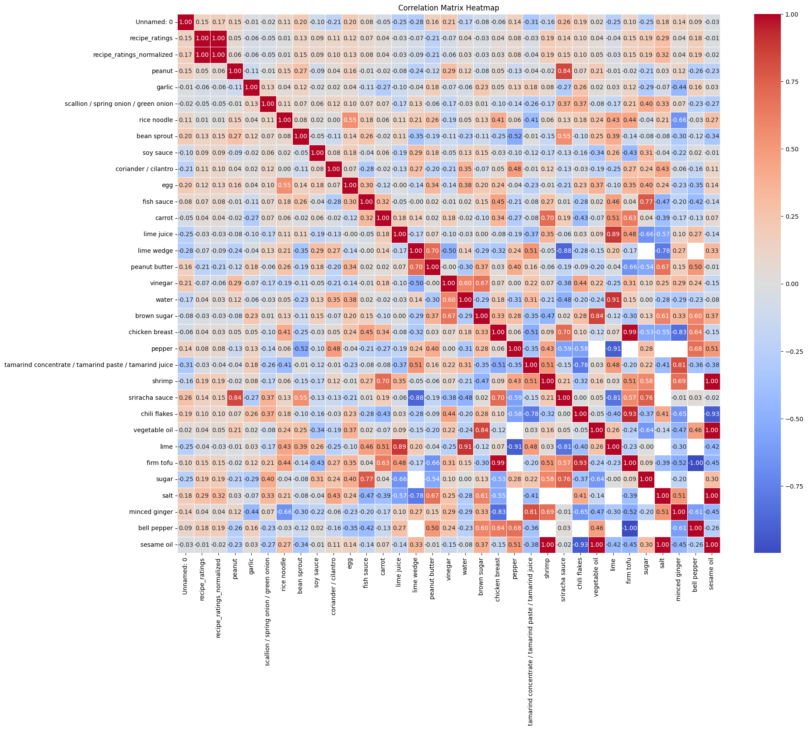
    

***
### **Interpretation of Variable Relationships**

**Review Scores:** 
recipe_ratings_normalized are perfectly correlated (1.00) to recipe_ratings, as it was mathematically derived from recipe_ratings.

**Number of Reviewers and recipe saved:** 
High positive correlation (>=0.80) between recipe_num_of_reviewers and recipe_num_saved

**Ingredient Amount:** 
High positive correlation (>=0.80) between some pairs of ingredients:
- peanut <> sriracha sauce
- lime juice <> lime
- water <> lime
- brown sugar <> vegetable oil
- chicken breast <> firm tofu
- tamarind <> minced ginger
- shrimp <> sesame oil
- chili flakes <> firm tofu
- vegetable oil <> sesame oil
- salt <> sesame oil 

This may indicate that these pairs of ingredients are commonly used together

High negative correlation (<=-0.80) between 
- lime wedge <> sriracha sauce
- chicken breast <> minced ginger
- pepper <> lime
- chili flakes <> sesame oil
- lime <> sriracha sauce
- firm tofu <> bell pepper 

This may indicate that, if one of the pair are used, then another will not likely be used (or decrease)

**Review Scores vs. Ingredient Amount:** 
No significant correlation between review scores (recipe_ratings / recipe_ratings_normalized) and all top 30 ingredients. 

Those variable pairs with high positive correlation suggests that as one variable in the pair increases, another should also tend to increase.
In contrast, variable pairs with high negative correlation suggests that as one variable in the pair increases, another tends to decrease. 
***

### **Data Visualization**

    
    Data Visualization
    
    Box plot and histogram of review scores, number of reviewers, and number of recipe saved by users
    ----------------------
    

    
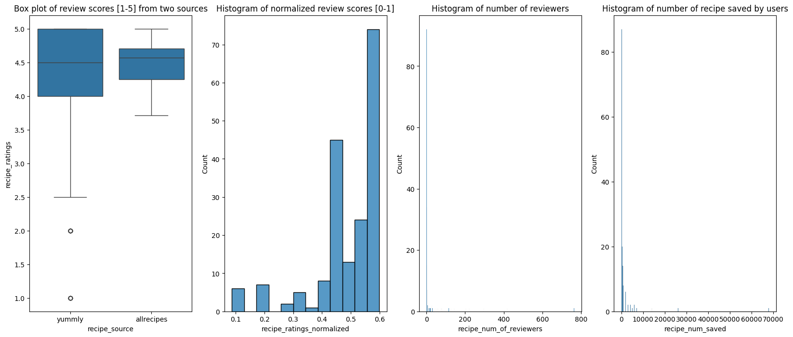
    

    
    Bar plot of recipe counts for each ingredient (top 30)
    ----------------------
    

    
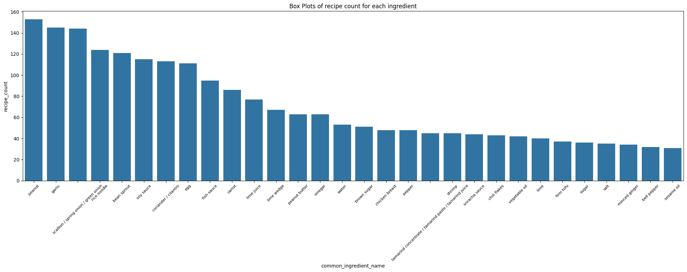
    

    
    Box plots of top 30 ingredients, group by same scale of units
    ----------------------
    

    
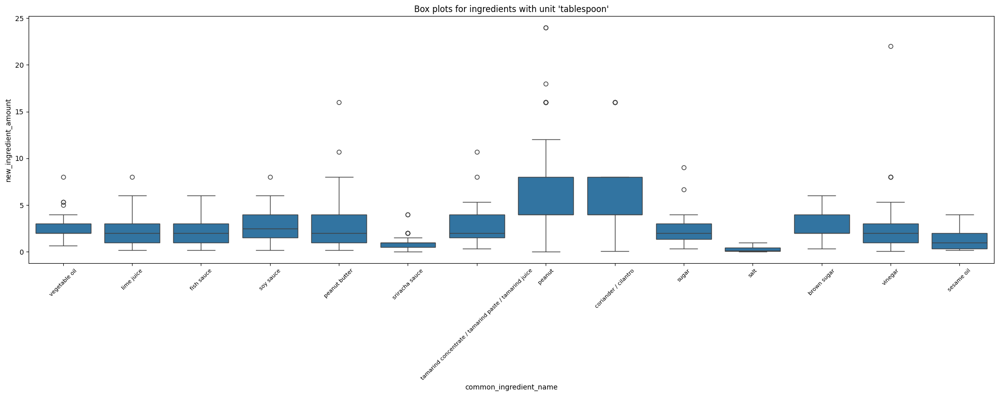
    

    
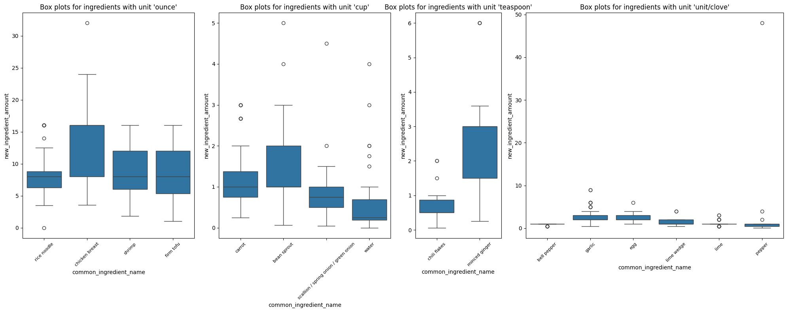
    

    
    Scatter plots between normalized score, and each of top 10 ingredients
    ----------------------
    

    
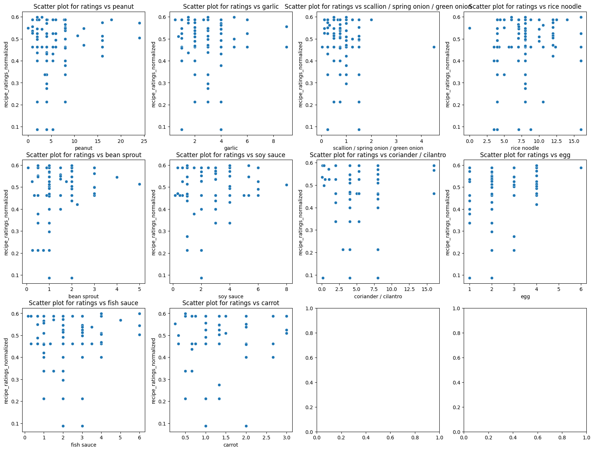
    

    
    Histograms for top 10 ingredients
    ----------------------
    

    
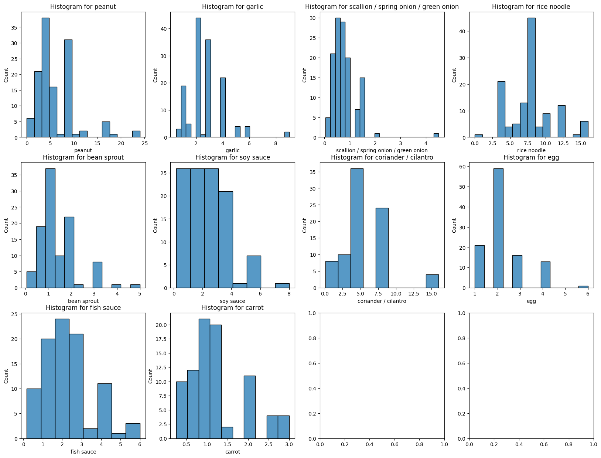
    

    
    Scatter plots for pairs of ingredients with high POSITIVE correlation
    ----------------------
    

    
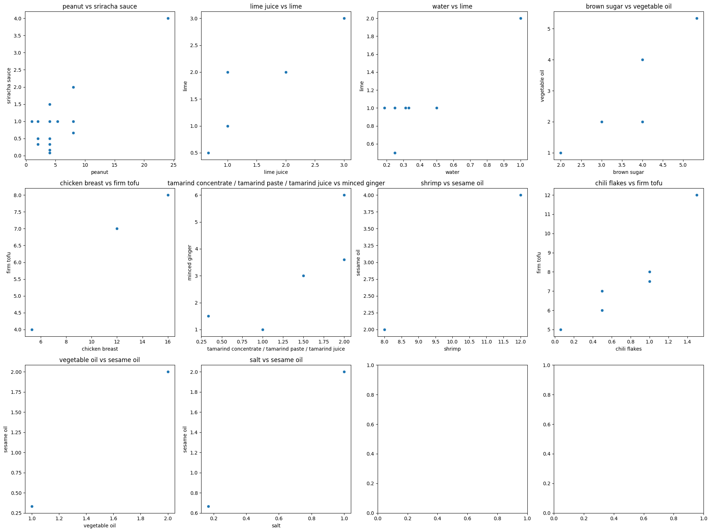
    

    
    Scatter plots for pairs of ingredients with high NEGATIVE correlation
    ----------------------
    

    
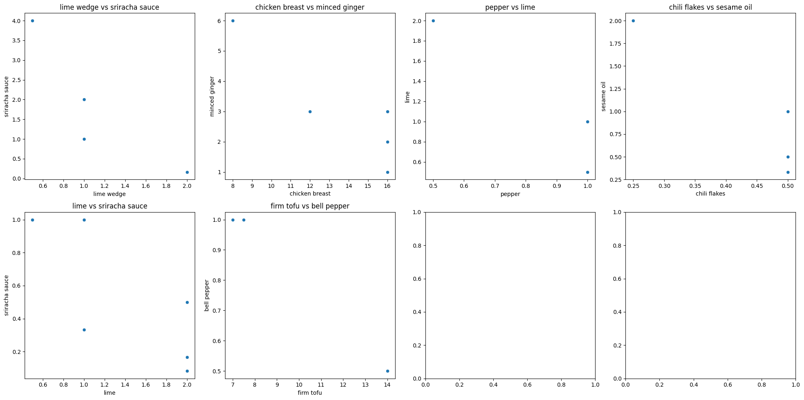
    

***
### **Interpretation of Data Visualizations**

Some histogram visualizations shows that the features may be Gaussian-like, however, many are not. 

Based on box plots, several features seems to have outliers. 

We have to be careful for any analysis that assume normal distribution, as many features are not Gaussian-like. 

Several scatter plots of ingredient pairs that show high correlation in the correlation matrix, turn out to have only a few data points. In order to imply that these pairs actually have high correlation, we have to add more recipes from other recipe sources to our analysis. 
***

### **Missing Values, Duplicates, and Outliers**

**Duplicates:** 
There is no duplicated rows in the dataset. 

**Missing Values:** 
**recipe_num_saved and ingredient_remainder:** 
The number of saved recipes (recipe_num_saved) are from Yummly.com only, as it does not exist on Allrecipes.com. The ingredient_remainder comes from a text description/detail of how to prepare ingredients before cooking, and is available on Yummly.com. On Allrecipes.com, the detail/preparation note of ingredients are included in the name of the ingredients themselves. 

While many of ingredient_remainder are missing, we should retain it for further qualitative analysis (to complement our quantitative analysis). In fact, we used ingredient_remainder to determine common ingredient name, ingredient category, ingredient unit, or ingredient amount for some ingredients, because some recipe creators chose to provide those detail in ingredient_remainder instead.

**Ingredient amount/unit:** 
There are some missing data in ingredient amount/unit from the sources (original_ingredient_amount and original_ingredient_unit), as the creators did not specify them on the websites. We left them  missing as it is, and provide new_ingredient_unit as a substitute. The new_ingredient_unit utilitzed default_unit, to fill in missing ingredient units. In case where original_ingredient_amount is missing, the new_ingredient_amount is left being NaN, as it may impact our analysis, such as calculation of simple mean. 

There are some ingredients with high proportion of missing ingredient amount, especially those used for just garnishing (chili, lime/lemon, etc.), or typical ingredients such as water. Users of this dataset may choose to remove certain categories of these ingredients (for garnishing) while keeping the rest for their own analysis. For those that are not for garnishing, we cannot remove them, as they may be vital to recipes. In fact, we may consider using the existence of them (existing or not) as one of the variables/flag for analysis.

**Outliers:** 
There are several features that seem have outliers. However, we cannot remove these as they are from recipes for special needs, such as vegan, high-protein, keto, or low-fat/low-carb, which contains higher/lower amount of ingredients than typical recipes. 
***

### **Data Transformation and New Features**

By webscraping, we get original ingredient name, amount, and unit from the two websites. Mapping table from ingredient_unit_mapping.csv is used to map original measurement unit to equivalent common name of unit. With unit_conversion.csv, measurement unit conversion has been applied such that all similar ingredients used the same default_unit, where possible. 

We use ingredient_name_mapping.csv to identify common_ingredient_name for each original ingredient name, while ingredient_category_mapping.csv maps common_ingredient_name to ingredient_category. 

**New Feature: recipe_ratings_normalized** 
We use two food recipe portal websites in order to increase sample size, so we have to normalize scores first because the mean of ratings from the two websites are different. For example, ratings given by a website with a lot of food experts may be lower compared to a website targeting beginners. 

We have normalized ratings from the two websites by subtracting the review scores with its own weighed average of ratings, dividing by range of possible max/min scores that all users can give in reviews [max score: 5, min score: 1, range = 5 - 1 = 4]. This results in new ratings ranging from -1 to 1. After that, we rescale them by adding 1 and dividing it by 2, in order to get new ratings ranging from 0 to 1. The normalized ratings are provided in order to facilitate comparison of ratings from two different recipe sources. 

**Interpretation of New Features:** 
The normalized ratings ranges from 0 to 1, which are easier to use to train a model. It reflects how far individual review score from its respective weighted average ratings on its website. Its mean is 0.493320, and the median is 0.524874, which is close to the mean, with min of 0.087374, max of 0.598381, and standard deviation of 0.118206. Based on the histogram, however, we found that the ratings are clustered around the range from 0.45 to 0.60. The normalized ratings is perfectly correlated to original ratings on the two websites. 

The preliminary analysis and visualization of normalized ratings are provided in the sections above. (Descriptive Statistics, Variable Relationships, and Data Visualization) 
***

### **Dimensionality Reduction**

We have not performed dimensionlity reduction by using PCA or other methods. We, nevertheless, provide ingredient_category as an alternative to common_ingredient_name.
There are over 178 common_ingredient_name in the dataset (608 for original ingredient name), while the number of ingredient_category is just 27. 

The number of ingredient_category can be further reduced by removing some categories which are not typically used in Pad Thai, such as quinoa, rice paper wrappers, seaweed, yeast, and cheese/butter. If you choose to remove these ingredient categories, their associated recipes (only a few recipes) should also be removed. Water can also be removed as it is generally required in cooking, and many creators excluded it from the list of ingredients. In case where water category is removed, no need to remove relevant recipes because the remaining recipes also used water but they exclude water from their ingredient list. The number of ingredient_category after removal of these categories is 21. 

The mapping used to identify common_ingredient_name for each original ingredient name is provided in ingredient_name_mapping.csv, while ingredient_category_mapping.csv maps common_ingredient_name to ingredient_category. 

Where ingredient_category is used as a replacement for common_ingredient_name, there should be some information loss after the reduction. 
***

### **Data Quality Assessment**

**Data Profiling:** 
This Pad Thai recipe data is collected from two data sources: Yummly.com and Allrecipes.com in October 2024, by web scraping. It comprises of 185 Pad Thai recipes recipes, all of which includes recipe name, creator name, review score (ratings), link to website, and corresponding ingredient name/amount/unit. 

The ratings and ingredient amount are provided in numerical float format, while the rest are text. There are some missing data in original ingredient amount/unit from the sources and are intentionally left missing as it is. The new_ingredient_unit utilitzed default_unit, to fill in missing ingredient units.  

**Data Completeness:** 
We found some missing values that we may be able to handle, and it is ingredient unit. Missing ingredient amount is not filled with zero, as it may impact our analysis, such as calculation of arithmetic mean. 

**Data Accuracy:** 
All records are pulled from two websites by webscraping tool. We have done a random cross-check a sample of records on the two websites. 

**Data Consistency:** 
Based on most frequent values, there is no potential inconsistencies or anomalies. 

**Data Integrity:** 
recipe_id are unique, and ingredient data seems to be in line with typical Pad Thai recipes outside Thailand. 

**Data Lineage and Provenance:** 
The Pad Thai recipe dataset is collected Yummly.com and Allrecipes.com, two prominent recipe portals in October 2024, by web scraping. The recipes were created by users on these portals, and review scores were given by other users of these platforms 

We provide normalized ratings in order to facilitate comparison of ratings from two different recipe sources, and also provide ingredient category to effectively reduce dimensionality of the dataset. 
***
